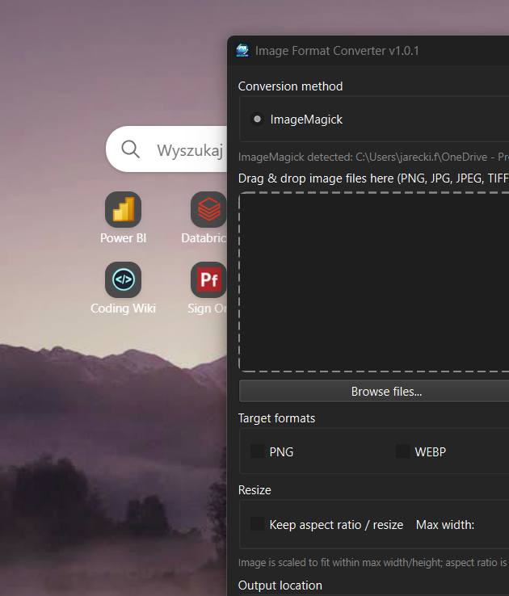

# Image Format Converter

A small desktop GUI for batch-converting image files. It supports drag-and-drop, converting to multiple target formats in one run, optional aspect-ratio-preserving resize, custom output folders, and automatic light/dark theme matching.



## Features

- Batch conversion with drag-and-drop or file selection.
- **Input formats:** PNG, JPG/JPEG, TIFF/TIF, BMP, SVG, AVIF, and WebP.
- **Output formats:** PNG, WebP, AVIF, and ICO.
- Choose one or more output formats for each source file.
- Resize images to fit a maximum width and height while preserving aspect ratio.
- SVGs are rasterized sharply at the chosen output size; without resize they are rasterized at up to 2048 pixels.
- Save beside the source files or choose another output folder.
- Uses ImageMagick when available, with a Pillow-based conversion option.

## Requirements

- Windows, macOS, or Linux
- Python 3.10+
- [PySide6](https://pypi.org/project/PySide6/)
- [Pillow](https://pypi.org/project/pillow/)
- [pillow-avif-plugin](https://pypi.org/project/pillow-avif-plugin/) for AVIF support with the Pillow method

ImageMagick is optional but recommended. Install it and make sure the `magick` executable is available on `PATH` to use that conversion method.

## Install

1. Clone the repository.
2. Create and activate a virtual environment (recommended).
3. Install the Python dependencies:

   ```text
   pip install PySide6 Pillow pillow-avif-plugin
   ```

4. Run the application:

   ```text
   python image_converter.pyw
   ```

On Windows, double-clicking `image_converter.pyw` also starts the GUI without a console window.

## Use

1. Select **ImageMagick** or **Own method (Pillow)**.
2. Drag supported images into the drop area, or select **Browse files...**.
3. Select one or more target formats.
4. Optionally enable **Keep aspect ratio / resize** and enter maximum dimensions.
5. Choose whether to save beside the source images or in a selected output folder.
6. Select **Convert**.

> For ICO output, images are limited to 256 × 256 pixels, the conventional maximum icon size.

## Versioning

This project follows [Semantic Versioning](https://semver.org/). The source of truth for the current release is `APP_VERSION` in `image_converter.pyw`; release history is maintained in [CHANGELOG.md](CHANGELOG.md).

Current version: **1.0.1**

## License

No license has been specified yet. Add a license file before distributing or accepting external contributions.
